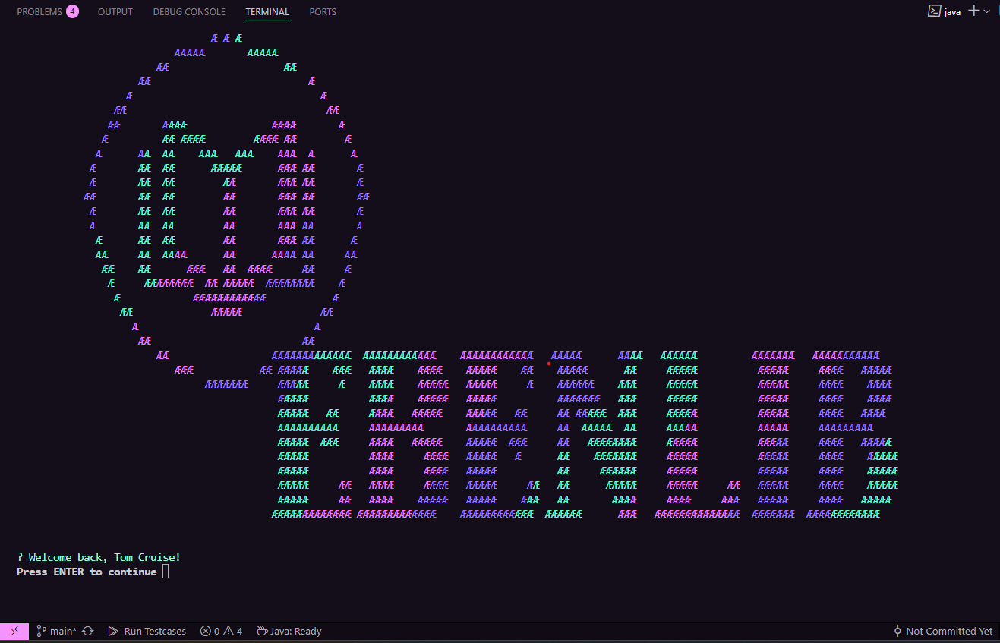

<p align="center">
  
</p>

<br/>
<br/>
<br/>



# EbenLib Library Management System

A Java‑based, offline‑first, console‑driven library management CLI. Written in pure Java, no external DB, data persisted to CSV/text files.

---

## 🚀 Quick Start

### Requirements

- Java 17+ (or your GraalVM distribution set as `JAVA_HOME`)
- Gradle 8+

### How to run

For dev, use the utility psh script to run

```psh
  ./run.ps1 --interactive

  # For help.

  .\run.ps1 --help

```

---

### Packaging

#### ⭑ Native Windows EXE (via GraalVM native-image)

1. Install GraalVM 21 CE and set `JAVA_HOME` →

   ```powershell
   $env:JAVA_HOME = 'C:\graalvm\jdk-21.0.2'
   $env:Path = "$env:JAVA_HOME\bin;$env:Path"
   ```

2. Ensure you have **Visual Studio Build Tools** (for `cl.exe`).
3. Build the “fat-jar” + native image:

   ```bash
   ./gradlew clean nativeImage
   ```

4. You’ll end up with `ebenlib.exe`.
   To test:

   ```powershell
   .\ebenlib.exe --interactive
   ```

> _Optional icon injection_ uses Resource Hacker if installed under
> `C:\Program Files (x86)\Resource Hacker\ResourceHacker.exe`.

#### ⭑ Fat-Jar Only

If you prefer a single JAR (no native-image):

```bash
./gradlew clean jar
java -jar app/build/libs/app.jar --interactive
```

---

## 📚 Command Reference

```text
ebenlib <category> <command>
```

### Core Commands

| Command            | Description                                                       |
| ------------------ | ----------------------------------------------------------------- |
| `--interactive`    | Launch the interactive, menu‑driven UI                            |
| `auth signin`      | Sign in to your account                                           |
| `auth signup`      | Register a new Reader or Librarian                                |
| `auth signout`     | Sign out of the current session                                   |
| `user list`        | List all users (Librarian only)                                   |
| `user delete`      | Delete a user account                                             |
| `user promote`     | Promote a user to Librarian                                       |
| `user demote`      | Demote a Librarian to Reader                                      |
| `user deactivate`  | Suspend a user’s account                                          |
| `user activate`    | Reactivate a suspended user                                       |
| `book add`         | Add a book to inventory (Librarian only)                          |
| `book update`      | Update book details                                               |
| `book delete`      | Remove a book from inventory                                      |
| `book list`        | List all books                                                    |
| `book search`      | Search books by title/author/ISBN                                 |
| `book stats`       | Show stats for a given book (times borrowed, overdue count, etc.) |
| `borrow request`   | Request to borrow a book                                          |
| `borrow approve`   | Approve a borrow request (Librarian only)                         |
| `borrow reject`    | Reject a borrow request (Librarian only)                          |
| `borrow return`    | Return a borrowed book                                            |
| `borrow list`      | List all pending borrow requests                                  |
| `borrow history`   | Show your personal borrowing history                              |
| `profile view`     | View your user profile                                            |
| `profile update`   | Update your username                                              |
| `profile password` | Change your password                                              |
| `system seed`      | Initialize or reset system data (Librarian only)                  |
| `system import`    | allows to get in data from external sources                       |
| `system export`    | allows for backing up data                                        |
| `system config`    | allows for configuring some system functions                      |
| `report views`     | Report: summary stats                                             |
| `report books`     | Report: book report stats                                         |
| `report borrows`   | Report: borrow stats                                              |
| `report users`     | Report: user stats                                                |
| `test`             | Run the built‑in console UI tests                                 |
| `--help`, `-h`     | Show this help message                                            |

_Use `ebenlib <category> <command> --help` for detailed usage._

---

### 🔧 Examples

```bash
# Sign up new Librarian
ebenlib auth signup

# Sign in
ebenlib auth signin

# Add a new book
ebenlib book add --title="1984" --author="Orwell" --copies=5

# Search books
ebenlib book search --title="Potter"

# Borrow a book
ebenlib borrow request --book-id=42

# Run the interactive menu
ebenlib --interactive
```

---

## 🗂 Project Structure

```java


./Library-Management-System/*
        ├─ app/*
        |       ├─ src/*
        |       |       ├─ main/*
        |       |       |       ├─ java/*
        |       |       |       |       ├─ org/*
        |       |       |       |       |       └─ ebenlib/*
        |       |       |       |       |               ├─ book/*
        |       |       |       |       |               |       ├─ Book.java
        |       |       |       |       |               |       ├─ BookHandler.java
        |       |       |       |       |               |       ├─ BookService.java
        |       |       |       |       |               |       └─ BookStats.java
        |       |       |       |       |               ├─ borrow/*
        |       |       |       |       |               |       ├─ BorrowHandler.java
        |       |       |       |       |               |       ├─ BorrowRecord.java
        |       |       |       |       |               |       ├─ BorrowSettings.java
        |       |       |       |       |               |       ├─ BorrowStore.java
        |       |       |       |       |               |       └─ Status.java
        |       |       |       |       |               ├─ cli/*
        |       |       |       |       |               |       ├─ AuthHandler.java
        |       |       |       |       |               |       ├─ CommandRouter.java
        |       |       |       |       |               |       ├─ ConsoleThemeTest.java
        |       |       |       |       |               |       ├─ ConsoleUI.java
        |       |       |       |       |               |       ├─ InteractiveMenus.java
        |       |       |       |       |               |       ├─ InteractiveShell.java
        |       |       |       |       |               |       └─ TablePrinter.java
        |       |       |       |       |               ├─ ds/*
        |       |       |       |       |               |       ├─ EbenLibComparator.java
        |       |       |       |       |               |       ├─ EbenLibFunction.java
        |       |       |       |       |               |       ├─ EbenLibHashSet.java
        |       |       |       |       |               |       ├─ EbenLibList.java
        |       |       |       |       |               |       ├─ EbenLibMap.java
        |       |       |       |       |               |       ├─ EbenLibMapEntry.java
        |       |       |       |       |               |       ├─ EbenLibPriorityQueue.java
        |       |       |       |       |               |       ├─ EbenLibSet.java
        |       |       |       |       |               |       └─ EbenLibStack.java
        |       |       |       |       |               ├─ profile/*
        |       |       |       |       |               |       └─ ProfileHandler.java
        |       |       |       |       |               ├─ report/*
        |       |       |       |       |               |       └─ ReportHandler.java
        |       |       |       |       |               ├─ searchsort/*
        |       |       |       |       |               |       ├─ Searcher.java
        |       |       |       |       |               |       └─ Sorter.java
        |       |       |       |       |               ├─ system/*
        |       |       |       |       |               |       └─ SystemHandler.java
        |       |       |       |       |               ├─ user/*
        |       |       |       |       |               |       ├─ Role.java
        |       |       |       |       |               |       ├─ User.java
        |       |       |       |       |               |       ├─ UserHandler.java
        |       |       |       |       |               |       └─ UserStore.java
        |       |       |       |       |               ├─ utils/*
        |       |       |       |       |               |       └─ FileUtil.java
        |       |       |       |       |               └─ App.java
        |       |       |       |       └─ module-info.java
        |       |       |       └─ resources/*
        |       |       |               ├─ books.csv
        |       |       |               ├─ borrows.csv
        |       |       |               ├─ session.csv
        |       |       |               ├─ settings.txt
        |       |       |               └─ users.csv
        |       |       └─ test/*
        |       |               ├─ java/*
        |       |               |       └─ org/*
        |       |               |               └─ ebenlib/*
        |       |               |               └─ AppTest.java
        |       |               └─ resources/*
        |       ├─ build.gradle
        |       ├─ ebenlib.exe
        |       └─ ebenlib.ico
        ├─ src/*
        |       └─ main/*
        |               └─ resources/*
        |               ├─ books.csv
        |               └─ borrows.csv
        ├─ .fttignore
        ├─ .gitattributes
        ├─ .gitignore
        ├─ demo.png
        ├─ gradle.properties
        ├─ gradlew
        ├─ gradlew.bat
        ├─ README.md
        ├─ run.ps1
        └─ settings.gradle

```

---

## 🔧 Data Structures & Algorithms

- **EbenLibList<T>**
  _Dynamic array_ with O(1) random access, amortized O(1) append, O(n) remove.
- **EbenLibStack<T>**
  LIFO built on `EbenLibList`: `push`, `pop`, `peek` all O(1).
- **EbenLibMap\<K,V>**
  Chained-hash table: average O(1) `get`/`put`/`remove`; rehash at load > 0.75.
- **EbenLibPriorityQueue<T>**
  Binary-heap: O(log n) insert & remove-max/min.
- **EbenLibHashSet<T>**
  Wrapper over `EbenLibMap<T,Boolean>`, O(1) contains/add/remove.
- **Binary Search**
  O(log n) on pre-sorted `EbenLibList` via `Searcher.binarySearch`.
- **Merge Sort**
  O(n log n) stable sort implemented in `Sorter.mergeSort`.

---

## 🌱 Developer Notes

- **Adding new commands**:

  1. Extend `CommandRouter.route(...)`.
  2. Implement a new handler class (e.g. `BookHandler`).
  3. Wire it in `CommandRouter` and add stubs in `InteractiveMenus`.

- **Interactive UI**:
  Uses ANSI colors, pagination, spinners—fully themable via `ConsoleTheme`.

- **Native packaging**:
  For lightning‑fast startup, use GraalVM’s `native-image` to compile into a standalone `ebenlib` binary. See [GraalVM docs](https://www.graalvm.org/).

---

## 🤝 Contributing

1. Fork this repo
2. Create your feature branch (`git checkout -b feature/xyz`)
3. Commit your changes (`git commit -m "feat: add XYZ"`)
4. Push to your branch (`git push origin feature/xyz`)
5. Open a Pull Request
